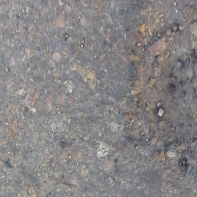
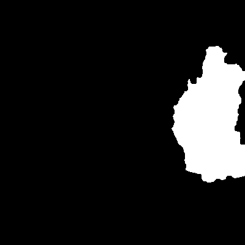
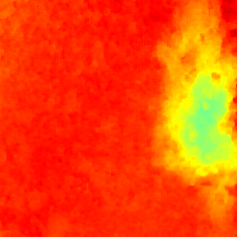
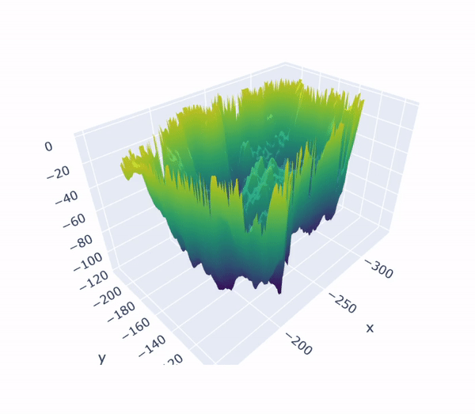
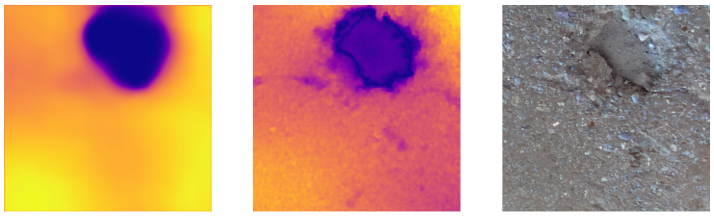
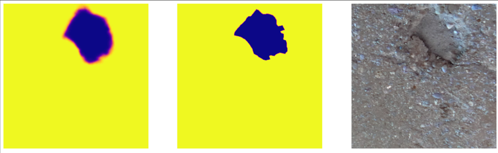
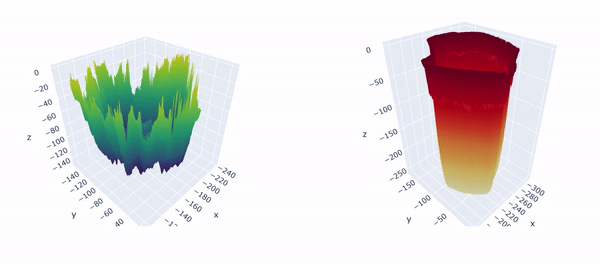
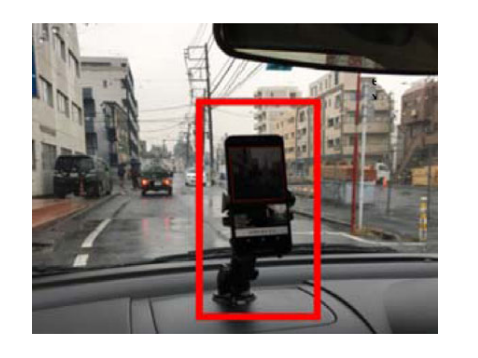
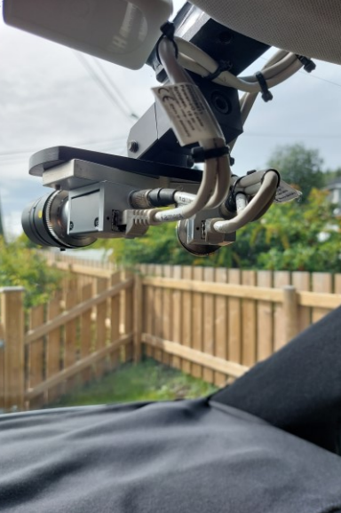
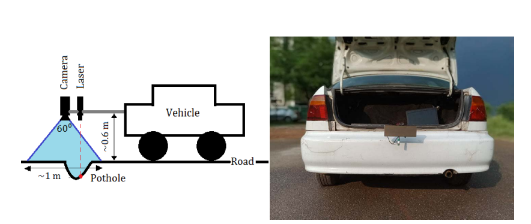

<br>
<hr style="height:4px;border-width:10;color:blue;background-color:black">

<h1 align="center">

<br>  Green Road
</h1>


<hr style="height:4px;border-width:10;color:blue;background-color:black">

<br><br><br><br>


## Background:
<hr style="height:1.5px;border-width:10;color:blue;background-color:black">

The pothole detection and localization could be seen as an object detection problem and propose a solution by using the computer vision techniques like Yolo-based models. There are several problems with using such a technique, like the amount of time taken to train the model as well as it is not resistant to weather fluctuations or the intensity of lighting, etc. To test the potential of this approach on pothole detection I found a labelled open-source dataset. With using Yolov8, the model has been trained on 4 different classes, including potholes and cracks. The dataset is diverse, from different countries with different conditions, yet the model seems to struggle, especially in recognising the pothole(s) from the background. I reviewed the work that has been done on this dataset of different teams for the years 2020, 2021, and 2022. Still, the maximum score does not reach 70%. In order to overcome this problem, we can look at the problem of spotting potholes as a mixture of distinctive colours and different textures. Usually, the surface of the pothole from the inside is rougher than the surface of the street in general, and there are also borders that often come in an oval shape. As for the colour difference, the inside of the pothole is often either darker than the colour of the road in general, especially if it contains water, or lighter due to the accumulation of dirt. Therefore, looking at this problem from this perspective makes sense.
The dataset is broad, coming from several countries with a range of circumstances, yet the model appears to have difficulties, especially when it comes to identifying the pothole(s) against the background. For the years 2020, 2021, and 2022, I looked over the work that's been done on this dataset of various teams. However, the greatest score falls short of 72%. To solve this issue, we might consider the issue of recognizing potholes as a combination of recognizable colors and various textures. The inside of the pothole typically has a rougher surface than the rest of the roadway, and its boundaries frequently have an oval form. Regarding the color difference, the interior of the pothole is frequently either lighter due to the smear of dirt or darker than the general color of the road. This is especially true if the pothole contains water. Therefore, approaching this issue from this angle makes sense.

A pipeline of four phases is suggested by the Green Road project:
A pipeline of four phases is suggested by the Green Road project:
1. Without localisation, determine whether the road image has a pothole or not. In order to determine if an image has a pothole or not, a classifier is trained by extracting the 160 features— about colors and textures—from each image.


If a pothole has been found, the image and its location will be saved so that steps 2 and 3 can be followed.
2. After identifying the RGB pothole, we must localize it and create a mask for it bu using a U-Net based model.
3. A final model will be used to the same RGB image to forecast its depth map.
4. To reconstruct the 3d view of the pothole, both of the outputs from stages 2 and 3—the mask prediction and the depth map prediction—will be employed.

With the right training dataset, the end user only needs to provide one RGB image, and the 3-D reconstruction pipeline will be completed in about 5s (this was tested on Colab CPU, taking into account the time to load the three models' weights from Drive).

The images below shows the Green Road project pipeline.
<br><br>


<h6 align="center">
  <br/>
    <br>  STEP 1: Single RGB image
</h6>
<br><br>

<h6 align="center">
  <br/>
    <br>  STEP 2: The mask of RGB image
</h6>
<br><br>

<h6 align="center">
  <br/>
    <br>  STEP 3: The depth map of RGB image
</h6>
<br><br>

<h6 align="center">
  <br/>
    <br>  STEP 4: 3D view reconstruction
</h6>
<br><br>


<br><br>


## What are the advantages of this approach?
<hr style="height:1.5px;border-width:10;color:blue;background-color:black">


1. This approach depend on monocular Depth Estimation, which means we need only one image to predict it's depth map (despite how the training data are collected and generate it's depth map).
2. The mask labelling allow us to detect the pothole(s) edge to have accurate 3-d representation as well as the count of the pothole(s) in the images.
3. The classifier is super fast as well as it's have been tested on the hackathon dataset with non misclassification images.
4. The data collecting for the classifier have a low cost, we only need to take images every 1s for example or taking images from a video. And the labelling could be done fast, either 0 (no pothole) or 1 (pothole). More over, the classifier need a few K of images to return a good results, with around 4k, the F-1 score reach 97.5%.

5. Any image have a label 0 by the first model (pothole classifier) could be deleted to save the memory and power for the devices, and the rest could go to for the next steps.
6. The classifier is resistent to the different lighting and rotation. 


<br><br>


## Results:
<hr style="height:1.5px;border-width:10;color:blue;background-color:black">


| Operation             | Description                                                                                                                                                                                                                                             | 
|-----------------------|---------------------------------------------------------------------------------------------------------------------------------------------------------------------------------------------------------------------------------------------------------|
| `Potholes Classifier` | On average each image takes 125 ms ± 979 µs to be ready for modelling.                                                                                                                                                                                  |
| `Potholes Classifier` | The total training in Colab CPU time is 2s, which means the time to train one image is 0.0008233841086867024 s This means to train 1M image it will take 823.3841086867023 s, which means 13.723068478111706 min.                                       |
| `Potholes Classifier` | 97.5 F-1 Score have been achieved😊😊😊.                                                                                                                                                                                                                |
| `Depth Map Estimator` | The total potholes training data are 440 (Labeled open source dataset), with rotating each image by 90 and 180 degree. Some images from nyu dataset have been added with it's own depth map to enhance the result.                                      |
| `Depth Map Estimator` | The loss reach 0.12 on the test data.                                                                                                                                                                                                                   |
| `Depth Map Estimator` | The total time for training was about 1h with free Colab GPU with10 epochs.                                                                                                                                                                             |
| `Depth Map Estimator` | The depth prediction could be done in 2s.                                                                                                                                                                                                               
| `Mask Labelling`      | The total potholes training data are 440 (Labeled open source dataset), some augmentation have been done like blurring and adding noise.                                                                                                                
| `Mask Labelling`      | The test dataset metrics are: loss: 0.0419 - accuracy: 0.9833 - binary_io_u: 0.9145 - precision: 0.9441 - recall: 0.8896                                                                                                                                |
| `Mask Labelling`      | The best result have been achieved after 19 epoch with less than 3h for training on free Colab GPU.                                                                                                                                                     |
| `Mask Labelling`      | The mask prediction could be done in 2s.                                                                                                                                                                                                                |
| `Total time`          | 6s, is enough time to run the whole Green Road pipeline for each image and this include the time for loading the weights from drive (This number have been calculated by running the model on 80 images and divide the total time on the images number) |


The following images are a comparison between the true images for mask, depth map and 3d reconstruction versus the models predictions.


<h6 align="center">
  <br/>
    <br>  Depth map prediction (left), True depth map (center), Real RGB image (right)
</h6>
<br><br>


<h6 align="center">
  <br/>
    <br>  Mask prediction (left), True mask (center), Real RGB image (right)
</h6>
<br><br>


<h6 align="center">
  <br/>
    <br>  Real 3D view reconstruction (left), Predicted 3D view reconstruction (right)
</h6>
<br><br>

 **NOTE:**

By the real 3D view reconstruction, I mean the 3D view reconstruction by using a good depth map + good mask.
And the predicted 3D view reconstruction is done by using the predicted depth map + predicted mask.

The mask and depth map results both have potential for improvement.

This [article](https://arxiv.org/abs/1812.11941) uses a large number of images to create a depth map, and the findings are quite promising. I tried it myself and got comparable outcomes.
Increasing the amount of photos might therefore be a solution for the depth map.

A combination of the masks plus a decent depth map might improve the outcomes and sharpen the edge. In this [article](https://yuxiangsun.github.io/pub/TIM2022_mafnet.pdf), the RGB image and the disiaprty map are combined, and the findings are promising. In order to get more trustworthy findings, I'm considering training the algorithm to forecast the disparity transformation map rather than the depth map.


<br><br>


## How Green Road could be implemented in real life?
<hr style="height:1.5px;border-width:10;color:blue;background-color:black">

1. Fitting cameras to Saudi mail trucks, public transportation vehicles, and other non-sensitive vehicles In this level, a standard camera and GPS are sufficient with just the classifier model. The picture will only be kept if a pothole is found; else, it will be drained. (except the images for the training, we need both classes).

2. Since the classifier model is quick and light, just the photographs of potholes are stored, memory and power usage may be extended, so after a while these discovered potholes are transformed to the remainder of the pipeline.

3. For 3D pothole reconstruction, it is recommended to take photographs from a set distance and to convert the pixels' width and height to centimeters. According to the studies I read, it also produces superior outcomes.

<h6 align="center">
  <br/>
    <br>  Possible option to take pictures for the potholes classifier
</h6>
<br><br>


<h6 align="center">
  <br/>
    <br>  Possible option to take pictures for the potholes classifier
</h6>
<br><br>


<h6 align="center">
  <br/>
    <br>  Possible option to take pictures for the potholes 3d reconstruction
</h6>
<br><br>


## How to use Green Road:
<hr style="height:1.5px;border-width:10;color:blue;background-color:black">


1. Load the models weights.
2. Make sure of your path(s) in the `3_D_reconstruction.py`
3. If you are in Colab run:
```bash
%run /content/3_D_reconstruction.py
```
If you are in your local machine run:
```bash
!python /content/3_D_reconstruction.py
```

<br><br>
To reproduce the same results:

Dataset:
1) [Potholes600](https://sites.google.com/view/pothole-600/dataset)
2) [Pothole Detection Dataset](https://www.kaggle.com/datasets/atulyakumar98/pothole-detection-dataset)
3) [KITTI-Road-Segmentation](https://www.kaggle.com/datasets/sakshaymahna/kittiroadsegmentation)
4) [annotated-potholes-dataset](https://www.kaggle.com/datasets/tikoboss/annotatedpotholesdataset)
5) [smartathon dataset](https://smartathon.hackerearth.com/#themes)


Notebooks:
1) Follow the potholes classifier.ipynb notebook
2) Follow the GRAY_DEPTH_MODEL_WITH_nyu_depth_images.ipynb notebook
3) Follow the 3-D reconstruction.ipynb notebook
4) Follow the 3-D reconstruction.ipynb notebook


<br><br>